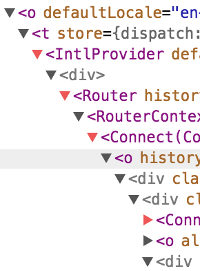

# eslint-node-6

```bash
npm install
npm start
```

A demonstration to show we can't rely on Babel to supply a valid `name/displayName` for React components when on Node 6.

Babel's `transform-react-display-name` plugin will only add `displayName` to components made with `React.createClass` automatically. For `class` and `function` (stateless) components, React will fallback to using the `name` of the `function` or `class`. This works fine when using the ES2015 to convert all arrow functions to normal functions as it gives them a name (using another Babel plugin - `transform-function-name`). However, when using ES2015 natively on Node 6 (filling in the gaps with `babel-preset-es2015-node6`) where a lot of it is implemented, arrow functions will be left as they are. This can create circumstances where functions no longer have a name. This means you'll most likely get failing tests and even errors thrown at runtime if your code is relying on consistent names. It also means if you're running server-side React with a Node 6 preset and client-side React with the normal ES2015 preset you might get inconsistencies and errors.

Relying on `function.name` can cause other problems too such as names being mangled through UglifyJS. This means the React Devtools fail to show proper names for components like in the image below. However, notice that components with a `displayName` like `Router` from `react-router` are unaffected by this:



The ideal scenario would be to patch the `transform-react-display-name` plugin to add `displayName` to React `class` and `function` components as well as `React.createClass` components. But maybe the `react/display-name` rule in `eslint-plugin-react` should be updated to represent what is actually happening until the Babel plugin is updated.
